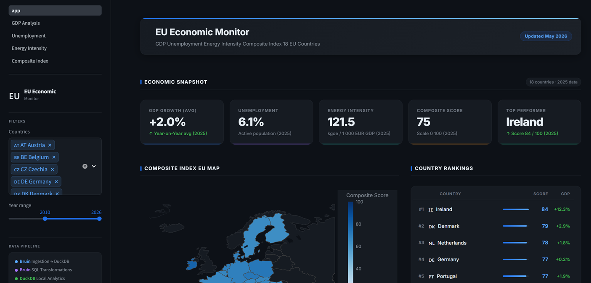
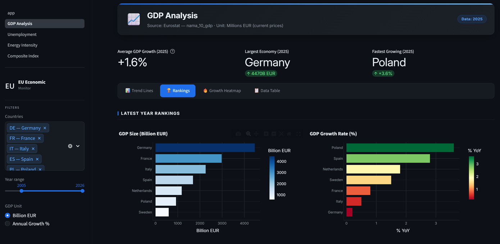
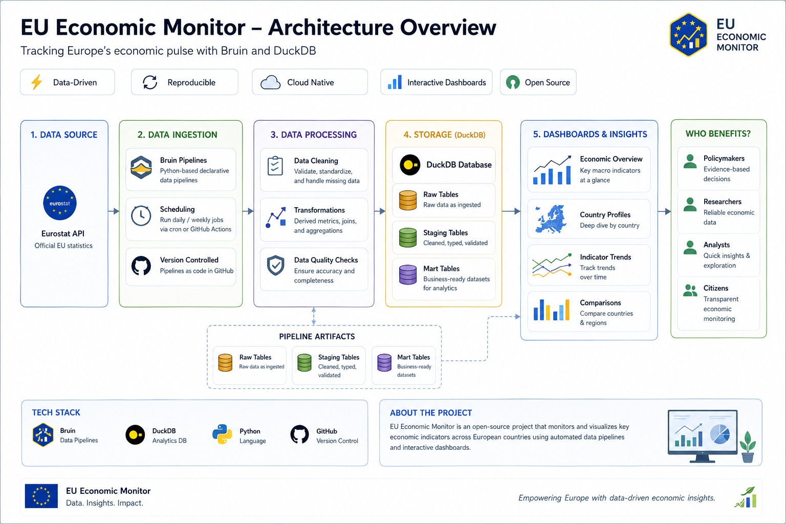

# EU Economic Monitor – Bruin + DuckDB Edition

> **Production-grade data pipeline** for European economic statistics using **Bruin CLI** and **DuckDB** - fully local, no cloud required.


---

## 🎯 Project Overview

This project demonstrates a complete end-to-end data engineering solution for monitoring and analyzing EU economic indicators. It implements modern data engineering best practices including Infrastructure as Code, containerization, stream processing, dimensional modeling, and real-time anomaly detection.

**Data Scope:** - **4 Economic Indicators:** GDP (annual growth), Unemployment rates, Energy Intensity, Inflation (HICP) - **18 EU Countries:** Austria, Belgium, Czech Republic, Germany, Denmark, Greece, Spain, Finland, France, Hungary, Ireland, Italy, Netherlands, Poland, Portugal, Romania, Sweden, Slovakia - **Time Range:** 2000-Latest - **Data Source:** Official Eurostat REST API

**Use Cases:** - Economic trend analysis and forecasting - Cross-country comparative analysis - Real-time monitoring of economic anomalies - Policy impact assessment - Academic research on EU economic integration - Learning modern data engineering patterns and tools

This project ingests, transforms, and visualizes **18 EU countries' economic indicators** (2000–Latest):
- **GDP** (annual, billions EUR)
- **Unemployment rate** (%)
- **Energy intensity** (KGOE per 1000 EUR)
- **Inflation** (HICP annual change %)

**Pipeline**: Eurostat REST API → DuckDB → Streamlit Dashboard

### Key Features
✅ **Zero Cloud Dependencies** - Runs entirely on your machine  
✅ **Unified Orchestration** - Single tool (Bruin CLI) replaces dlt + dbt + Airflow  
✅ **Fast Analytics** - DuckDB provides instant queries on 24 years of data  
✅ **Simple Setup** - No Docker, Kubernetes, or cloud accounts needed  
✅ **Production Patterns** - Staging → Intermediate → Marts data modeling  
✅ **Interactive Dashboard** - Streamlit with Plotly choropleth maps  

---

## 📸 Dashboard Preview

### Home - Economic Snapshot


### GDP Analysis


---

## 🏗 Architecture


<!-- ```
┌─────────────────────┐
│   Eurostat API      │  Fetch GDP, unemployment, energy, inflation
└──────────┬──────────┘
           │
           ▼
┌─────────────────────┐
│  Bruin Pipeline     │  Python ingestion assets
│   (4 assets)        │  → eurostat_raw schema
└──────────┬──────────┘
           │
           ▼
┌─────────────────────┐
│   DuckDB Database   │  Local embedded database
│  data/eurostat.db   │  • eurostat_raw (4 tables)
│                     │  • eurostat_processed (11 views/tables)
└──────────┬──────────┘
           │
           ▼
┌─────────────────────┐
│   SQL Transform     │  Bruin SQL assets
│   (11 assets)       │  • 4 staging views
│                     │  • 2 intermediate tables  
│                     │  • 5 mart tables
└──────────┬──────────┘
           │
           ▼
┌─────────────────────┐
│ Streamlit Dashboard │  Interactive analytics
│   (5 pages)         │  GDP / Unemployment / Energy / Composite
└─────────────────────┘
``` -->

---

## 🚀 Quick Start

```bash
# 1. Install Bruin CLI
curl -LsSf https://raw.githubusercontent.com/bruin-data/bruin/main/install.sh | sh

# 2. Install Python dependencies
pip install -r bruin_pipeline/pyproject.toml
pip install -r dashboard/requirements.txt

# 3. Run the pipeline
bruin validate bruin_pipeline
bruin run bruin_pipeline

# 4. Launch dashboard
cd dashboard && streamlit run app.py
```

📖 See [QUICKSTART_DUCKDB.md](QUICKSTART_DUCKDB.md) for detailed instructions.

---

## 🪟 Quick Execution on Windows

Two batch scripts are provided for one-click operation on Windows. Both scripts require [**uv**](https://github.com/astral-sh/uv) (a fast Python package manager). If `uv` is not installed, follow the prompt shown by the script.

### Install uv (one-time setup)

Open **PowerShell** and run:

```powershell
powershell -c "irm https://astral.sh/uv/install.ps1 | iex"
```

Restart your terminal after installation.

---

### `run.bat` - Full pipeline + dashboard

Runs the complete workflow in a single command:

1. **Syncs the Python virtual environment** using `uv sync` (creates/updates `.venv` automatically).
2. **Executes the Bruin pipeline** - fetches data from the Eurostat API, loads it into DuckDB, and runs all SQL transformations.
3. **Launches the Streamlit dashboard** at `http://localhost:8501`.

```bat
run.bat
```

> If the pipeline exits with a non-zero code (e.g. partial API failure), the script warns you and asks whether to proceed to the dashboard anyway. Press any key to continue or **Ctrl+C** to abort.

---

### `start_dashboard.bat` - Dashboard only

Starts the dashboard without re-running the pipeline. Use this when the database already contains up-to-date data:

```bat
start_dashboard.bat
```

The script:
1. Checks that `uv` is available.
2. Runs `uv sync` to ensure dependencies are present.
3. Launches the Streamlit app at `http://localhost:8501`.

Press **Ctrl+C** in the terminal to stop the dashboard.

---

### Typical Windows workflow

```text
# First run (or after a long gap - refresh the data)
run.bat

# Subsequent visits (data already loaded - just open the dashboard)
start_dashboard.bat
```

---

## 🛠 Technology Stack

| Component | Technology | Purpose |
|-----------|-----------|---------|
| **Orchestration** | Bruin CLI | Unified pipeline execution |
| **Database** | DuckDB | Local embedded analytics database |
| **Ingestion** | Python + Eurostat lib | API data fetching |
| **Transformation** | SQL (DuckDB dialect) | 4 staging views, 2 intermediate tables, 5 marts |
| **Dashboard** | Streamlit | Interactive visualization |
| **Dependencies** | pandas, plotly | Data manipulation & charts |

---

## 📊 Data Model

### eurostat_raw (Raw Layer)
- `gdp_annual` - GDP in millions EUR (nama_10_gdp)
- `unemployment_annual` - Unemployment rates % (une_rt_a)
- `energy_intensity` - KGOE per 1000 EUR GDP (nrg_ind_ei)
- `inflation_annual` - HICP annual change % (prc_hicp_aind)

### eurostat_processed (Analytics Layer)

**Staging Views** (cleaning & deduplication):
- `stg_gdp`, `stg_unemployment`, `stg_energy`, `stg_inflation`

**Intermediate Tables** (joins & calculations):
- `int_country_indicators` - All indicators joined by country + year
- `int_yoy_deltas` - Year-over-year changes and growth rates

**Mart Tables** (business layer):
- `mart_gdp_trends` - GDP trends with YoY metrics
- `mart_unemployment_comparison` - Cross-country unemployment analysis
- `mart_energy_intensity` - Energy efficiency trends
- `mart_composite_economic_index` - Normalized 0-100 composite score
- `mart_country_latest` - Latest snapshot for each country

---

## 📈 Dashboard Pages

### 1. Main Page
- **EU Economic Overview** with KPI cards
- Latest data for all countries
- Interactive choropleth map

### 2. GDP Analysis
- Time series trends by country
- Year-over-year growth rates
- Cross-country comparisons

### 3. Unemployment
- Unemployment rate trends
- YoY changes heatmap
- Country benchmarking

### 4. Energy Intensity
- Energy efficiency improvements
- Trends by country
- Progress tracking

### 5. Composite Index
- Economic health score (0-100)
- Component scores (GDP, unemployment, energy)
- Radar charts for country profiles
- Historical index trends

---

## 🧮 Composite Index Methodology

The Composite Economic Index (0-100) combines three normalized scores:

1. **GDP Score** (33.3%)  
   - Min-max normalization of YoY GDP growth  
   - Higher growth = higher score

2. **Unemployment Score** (33.3%)  
   - Inverted min-max normalization  
   - Lower unemployment = higher score

3. **Energy Score** (33.3%)  
   - Inverted min-max normalization of energy intensity  
   - Better efficiency = higher score

**Formula**:
```sql
composite_score = (gdp_score + unemployment_score + energy_score) / 3
```

---

## 📁 Project Structure

```
bruin_pipeline/
├── .bruin.yml              # DuckDB connection config
├── pipeline.yml            # Pipeline schedule & metadata
├── pyproject.toml          # Python dependencies
└── assets/
    ├── ingestion/          # 4 Python assets (Eurostat API)
    │   ├── ingest_gdp.py
    │   ├── ingest_unemployment.py
    │   ├── ingest_energy.py
    │   └── ingest_inflation.py
    ├── staging/            # 4 SQL views (cleaning)
    │   ├── stg_gdp.sql
    │   ├── stg_unemployment.sql
    │   ├── stg_energy.sql
    │   └── stg_inflation.sql
    ├── intermediate/       # 2 SQL tables (joins + YoY)
    │   ├── int_country_indicators.sql
    │   └── int_yoy_deltas.sql
    └── marts/              # 5 SQL tables (business layer)
        ├── mart_gdp_trends.sql
        ├── mart_unemployment_comparison.sql
        ├── mart_energy_intensity.sql
        ├── mart_composite_economic_index.sql
        └── mart_country_latest.sql

data/
└── eurostat.duckdb         # Local database (created by pipeline)

dashboard/
├── app.py                  # Streamlit main page
├── pages/                  # Dashboard pages
│   ├── 1_GDP_Analysis.py
│   ├── 2_Unemployment.py
│   ├── 3_Energy_Intensity.py
│   └── 4_Composite_Index.py
└── utils/
    ├── bigquery_client.py  # DuckDB query wrapper
    ├── charts.py           # Plotly chart functions
    └── style.py            # CSS styling
```

---

## 🔧 Development

### View Pipeline Lineage
```bash
bruin lineage bruin_pipeline
```

### Run Specific Assets
```bash
# Just ingestion
bruin run bruin_pipeline/assets/ingestion

# Just staging
bruin run bruin_pipeline/assets/staging

# Single asset
bruin run bruin_pipeline/assets/marts/mart_gdp_trends.sql
```

### Query DuckDB Directly
```python
import duckdb

conn = duckdb.connect('data/eurostat.duckdb', read_only=True)

# View schema
conn.execute("SHOW TABLES").fetchdf()

# Query data
df = conn.execute("""
    SELECT country_name, latest_year, composite_score
    FROM eurostat_processed.mart_country_latest
    ORDER BY composite_score DESC
    LIMIT 10
""").fetchdf()

print(df)
conn.close()
```

### Modify Configuration
Edit `.bruin.yml` to change DuckDB path:
```yaml
connections:
  duckdb-local:
    type: duckdb
    path: custom/path/to/database.duckdb
```

---

## 🌍 Supported Countries

- 🇦🇹 Austria (AT)
- 🇧🇪 Belgium (BE)
- 🇨🇿 Czechia (CZ)
- 🇩🇪 Germany (DE)
- 🇩🇰 Denmark (DK)
- 🇬🇷 Greece (EL)
- 🇪🇸 Spain (ES)
- 🇫🇮 Finland (FI)
- 🇫🇷 France (FR)
- 🇭🇺 Hungary (HU)
- 🇮🇪 Ireland (IE)
- 🇮🇹 Italy (IT)
- 🇳🇱 Netherlands (NL)
- 🇵🇱 Poland (PL)
- 🇵🇹 Portugal (PT)
- 🇷🇴 Romania (RO)
- 🇸🇪 Sweden (SE)
- 🇸🇰 Slovakia (SK)

---

## 🐛 Troubleshooting

### Pipeline fails to run
```bash
# Check Bruin installation
bruin --version

# Validate configuration
bruin validate bruin_pipeline

# Check Python dependencies
pip install -r bruin_pipeline/pyproject.toml
```

### Dashboard shows no data
```bash
# Run pipeline first
bruin run bruin_pipeline

# Check database exists
ls -lh data/eurostat.duckdb

# Use mock data mode
USE_MOCK_DATA=true streamlit run dashboard/app.py
```

### Permission errors (Windows)
- Run PowerShell as Administrator
- Check `data/` directory permissions

---

## 📚 Resources

- [Bruin Documentation](https://getbruin.com/docs)
- [DuckDB Documentation](https://duckdb.org/docs/)
- [Eurostat API](https://ec.europa.eu/eurostat/web/main/data/database)
- [Streamlit Documentation](https://docs.streamlit.io)

---

## 📝 License

MIT License - see [LICENSE](LICENSE) for details.

---

## 🙏 Acknowledgements

- **Eurostat** for providing open economic data APIs
- **Bruin team** for building an excellent data orchestration tool
- **DuckDB team** for the fast embedded analytics database
- **Data Engineering Zoomcamp** for project inspiration

---

## 🎓 About

This project demonstrates modern data engineering practices:
- ELT pattern (Extract-Load-Transform)
- Medallion architecture (raw → staging → intermediate → marts)
- Dimensional modeling (fact tables + dimension tables)
- Local-first development with DuckDB
- Unified orchestration with Bruin CLI
- Interactive analytics with Streamlit
